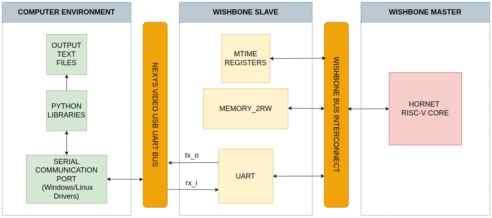
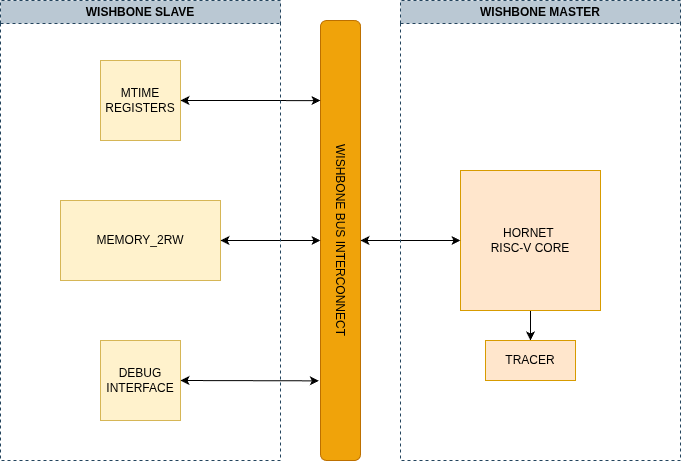

# Design and Implementation of RISC-V-Based Core For AI Applications


-blue)


**A lightweight, RV32IMF RISC-V soft-core ("Hornet") implemented on FPGA for edge-based network intrusion detection using a custom C-based MLP inference engine.**

---

## 📖 Table of Contents
- [Design and Implementation of RISC-V-Based Core For AI Applications](#design-and-implementation-of-risc-v-based-core-for-ai-applications)
  - [📖 Table of Contents](#-table-of-contents)
  - [🏛 System Architecture](#-system-architecture)
  - [🚀 About the Project](#-about-the-project)
  - [🏗 System Design \& Verification](#-system-design--verification)
    - [1. RTL Simulation Flow](#1-rtl-simulation-flow)
    - [2. Hardware-in-the-Loop (HIL) Flow](#2-hardware-in-the-loop-hil-flow)
  - [📂 Repository Structure](#-repository-structure)
  - [🛠 Prerequisites \& Toolchain](#-prerequisites--toolchain)
    - [Hardware Requirements:](#hardware-requirements)
    - [Python Dependencies](#python-dependencies)
  - [⚙️ How to Run (Hardware Verification)](#️-how-to-run-hardware-verification)
  - [👥 Team \& Acknowledgments](#-team--acknowledgments)
    - [Authors](#authors)
    - [Acknowledgments](#acknowledgments)
  - [📬 Contact](#-contact)

---

## 🏛 System Architecture
The design features the **Hornet** core (RV32IMF) integrated with a custom Wishbone wrapper and peripherals on the Nexys Video FPGA.



---

## 🚀 About the Project
This project presents the design and implementation of a lightweight, **RISC-V-based Edge AI processor** capable of executing deep learning inference for network security applications. The primary objective is to validate the feasibility of running a complex, floating-point-heavy Multi-Layer Perceptron (MLP) on a soft-core processor within an FPGA environment.

**Key Features:**
* **Core:** "Hornet" Processor (RV32IMF) – A custom 32-bit RISC-V core with Single-Precision Floating-Point support.
* **Hardware:** Implemented on Xilinx Nexys Video (Artix-7 XC7A200T).
* **Software:** Custom C inference engine (no heavy frameworks like TFLite) built from scratch.
* **Algorithm:** Custom Focal Loss MLP trained on the NSL-KDD dataset for 5-class network traffic classification.
* **Performance:** Achieved **78.87% accuracy** on hardware, matching the software model.

---

## 🏗 System Design & Verification

### 1. RTL Simulation Flow
Before going into the HIL flow, the design was tested on RTL Simulation using Vivado & XSim. The first verification topology is:

<div align="center">
  
</div>

<br>

### 2. Hardware-in-the-Loop (HIL) Flow
To ensure reliability, we developed a comprehensive verification suite. This flow validates the design by cross-referencing the Python Golden Model against both the RTL Simulation and the Physical FPGA output via UART, ensuring bit-accurate inference results. The second verification topology is:


---

## 📂 Repository Structure

This repository is organized by version and functionality.

```text
.
├── v_1.0_stable/            # PRIMARY STABLE RELEASE
│   ├── no_batch/            # Sequential inference implementation (No-Batch processing)
│   │   ├── MLP_No_Batch     # Main Vivado Project & RTL Source
│   │   ├── Python_Codes     # Training scripts, dataset pre-processing, and model weights
│   │   └── test/            # Simulation and Hardware verification testbenches
│   │
│   └── source/              # Core source files (RTL, linkers, bootloaders)
│
│
└── README.md                # Top-level documentation
```

## 🛠 Prerequisites & Toolchain

This project relies on specific tool versions to ensure synthesis reproducibility and accurate behavioral simulation.

### Hardware Requirements:
 * **Development Board:** Digilent Nexys Video (Artix-7 FPGA)
 * **Chip Compatibility:** Validated on XC7A200T (Artix-7) and XC7A100T (Artix-7).

| Tool | Version | Purpose |
| :--- | :--- | :--- |
| **Vivado** | 2025.1 | Synthesis, Implementation, and XSim |
| **RISC-V GCC** | 15.1.0 | Firmware compilation (rv32imf-unknown-elf) |
| **GCC (Host)** | 11.4.0 | Host-side test utilities |
| **Python** | 3.10.12 | ML Training & UART Interface |

### Python Dependencies
Required for training the model and running the UART test suite:
```bash
pip install tensorflow==2.20.0 numpy==2.2.6 pandas==2.3.3 scikit-learn==1.7.2 pyserial==3.5 matplotlib==3.10.7
```

## ⚙️ How to Run (Hardware Verification)

1. **Synthesize & Bitstream:** Open the project located in `v_1.0_stable/no_batch/MLP_No_Batch` using Vivado. Run Synthesis, Implementation, and Generate Bitstream.

2. **Program FPGA:** Connect your Nexys Video board via USB-JTAG and program the device with the generated `.bit` file using the Hardware Manager.

3. **Run UART Listener:** On your host machine, navigate to the Python scripts directory and start the serial listener to capture inference results.
   ```bash
   cd v_1.0_stable/no_batch/Python_Codes
   # Replace '/dev/ttyUSB1' with your actual COM port (e.g., COM3 on Windows)
   python3 serial_listener.py --port /dev/ttyUSB1 --baud 115200
   ```

4. Trigger Inference: Press the CPU Reset button on the FPGA board to initialize the Hornet core and begin the classification loop. The results will appear in your terminal.

## 👥 Team & Acknowledgments

This project was developed at Istanbul Technical University (ITU) as a graduation thesis.

### Authors
* **Yusuf Tekin** ([tekiny20@itu.edu.tr](mailto:tekiny20@itu.edu.tr))
    * *Role:* Software Design, Hardware/RTL Design, System Verification.
* **Ahmet Tolga Özkan** ([ozkanah19@itu.edu.tr](mailto:ozkanah19@itu.edu.tr))
    * *Role:* RTL Design for Hardware Accelerator.

### Acknowledgments
We would like to express our deepest gratitude to our advisor, **Prof. Dr. Sıddıka Berna Örs Yalçın**, for their invaluable guidance, technical insights, and mentorship throughout the development of the "Hornet" core.

---

## 📬 Contact

For inquiries regarding the hardware architecture, the software inference engine, or potential collaborations, please contact the authors via email or open an issue in this repository.

* **Yusuf Tekin:** tekiny20@itu.edu.tr
* **Ahmet Tolga Özkan:** ozkanah19@itu.edu.tr   